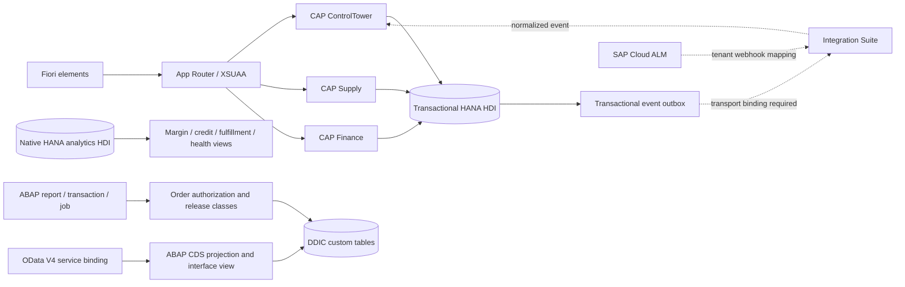

# Enterprise control tower

The CAP core separates master data, sales, purchasing, quality, production, inventory, logistics, billing, pricing, returns, warehouse and integration commands into typed services. The model includes business command receipts, external identifiers, audit records and leased outbox events. Company attributes govern order, stock, incident and journal operations. The application is single-tenant with multiple company codes; it is not an implemented SaaS tenant-isolation solution.

Order release checks authorization, command identity, revision, customer, credit and inventory; it creates reservations, a credit decision, an audit record and an integration event in the same database transaction. Failed later steps roll back earlier updates. Commands provide retry deduplication. Journal posting sums integer minor units and refuses unbalanced or mixed-currency entries.

Native HANA analytics has a separate HDI container and explicit SQLScript inputs. Ingestion from transactional CAP or S/4 data into analytics tables is an integration boundary to implement for the target landscape. Tables are not implicitly synchronized. The native analytics procedures are deployment sources; the CAP business workflows execute against the CAP-generated schema.

The ABAP folder provides a distinct operational implementation and repository export examples. It is useful for source exploration alongside the CAP extension; these are not two writers sharing one physical database. DDIC activation and standard type resolution require SAP. The service projection uses DCL for read access; it does not invent an activated endpoint.

The `src/domain/` ABAP policies and `enterprise/abap/analytics/` reducers execute in the ABAP transpiler tests. The target replaces the qualified analytics subset with generated SQLScript/AMDP and retains exact source copies only for validation. The CAP workflows are preserved; they are not falsely reported as ABAP-to-HANA migrations.

The external settlement worker reconciles a scoped SQL extract with bank CSV in the source. Its generated target obtains the same invoice contract through authenticated OData, using bounded endpoint-safe pagination and retries. Tests compare numeric and serialized reconciliation outputs.
